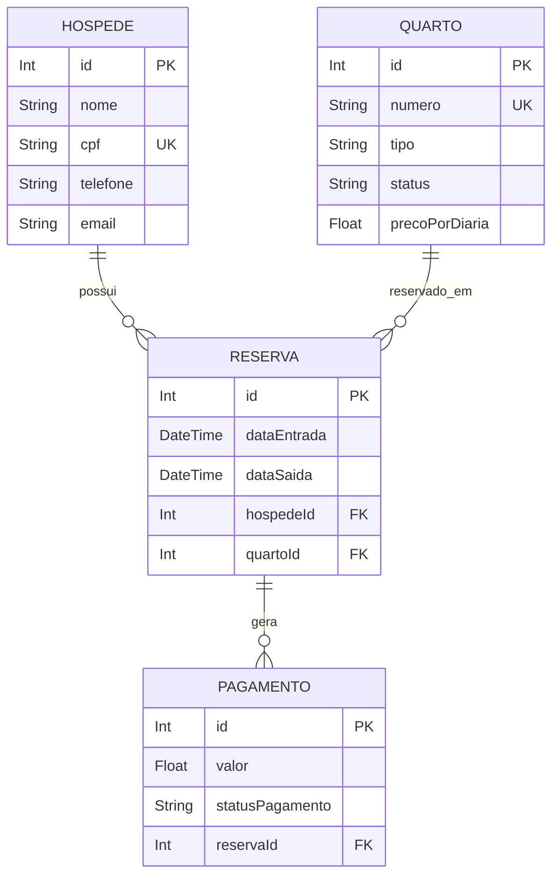

# Diagrama do Banco de Dados

Este documento representa a estrutura atual do banco de dados do Sistema de Hotel conforme definido no arquivo `schema.prisma`.

## Relacionamentos

* Um hóspede pode possuir várias reservas.
* Um quarto pode participar de várias reservas.
* Uma reserva pertence a um único hóspede.
* Uma reserva pertence a um único quarto.
* Uma reserva pode possuir vários pagamentos.

---

## Diagrama ER (Mermaid)

---

## Observações

### Campos Únicos (Unique)

* `Hospede.cpf`
* `Quarto.numero`

### Chaves Estrangeiras (Foreign Keys)

* `Reserva.hospedeId → Hospede.id`
* `Reserva.quartoId → Quarto.id`
* `Pagamento.reservaId → Reserva.id`

### Campos Opcionais

* `Hospede.email`

### Valores Padrão

* `Quarto.status = "disponivel"`
